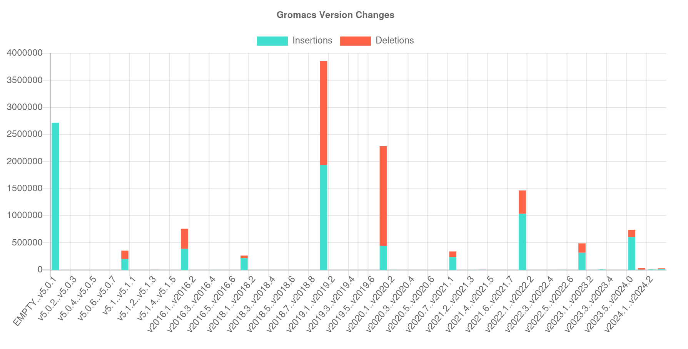

# Change Over Time

**Goals**

We want to figure out the importance of different variables that change over time, including:

 - code changes
 - dependencies
 - reflected in releases?
 - OS base images (for Dockerfile)
 
My initial goal was to find some containerized app, see if I can build old versions, and then run tests. We'd want to run the application across time and see when the largest changes to some metric of performance occur, and if that can be linked to some event. I suspect the biggest variable will be changes to the code itself.

## Gromacs

Let's test using [caliper](https://caliper-python.readthedocs.io/en/latest/getting_started/user-guide.html) to look at changes in the gromacs code.

```bash
pip install caliper-python
pip install setuptools jedi
caliper extract --outdir . github:gromacs/gromacs
```
That generates changes across time, as determined by GitHub, organized in [github](github). This includes:

- changedlines: is basically showing git changes (the plot below)
- totalcounts: is another GitHub metric, just the counts of files (not as useful)
- function-db: is pretty neat, because it's a database of functions for each version

Let's generate an image that shows changes over time:

```bash
mkdir -p docs/gromacs/changed-lines
caliper view ./github/gromacs-gromacs/changedlines/changedlines-results.json --title "Gromacs Version Changes"
mv index.html ./docs/gromacs/changed-lines/
```


The interactive plot does show data in the regions that appear empty - the changes are just so small they don't show up!

## License

HPCIC DevTools is distributed under the terms of the MIT license.
All new contributions must be made under this license.

See [LICENSE](https://github.com/converged-computing/cloud-select/blob/main/LICENSE),
[COPYRIGHT](https://github.com/converged-computing/cloud-select/blob/main/COPYRIGHT), and
[NOTICE](https://github.com/converged-computing/cloud-select/blob/main/NOTICE) for details.

SPDX-License-Identifier: (MIT)

LLNL-CODE- 842614


